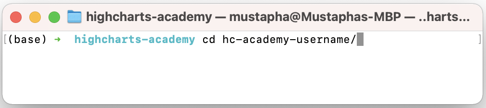

# Welcome to the Highcharts Academy Repository

This repository is your gateway to learning and exploring the Highcharts library through practical exercises. GitHub Classroom will automatically grade the exercises, making your learning journey seamless.

Each exercise is self-contained, allowing you to learn at your own pace. Automated tests are provided for each exercise, which you can also run locally to verify your solutions.

Remember to carefully follow the guidelines in the `README.md` files for each task. 

**Good luck!** 😊

---

## Prerequisites

Before you begin, ensure you have the following software installed on your local machine:

- **Node.js** (v14 or higher)
- **npm** (comes with Node.js)
- **Git**
- **Visual Studio Code (VS Code)** or a similar code editor like **Sublime Text** or **Atom** for writing and editing your code.

---

## Setup Instructions

### Step 1: Cloning the Repository

First, you need to clone the repository to your local machine. To do this, follow these steps:

1. Go to the GitHub Classroom link provided to you.
2. Accept the assignment, which will create a personal copy of the repository under your GitHub account.
3. Copy the repository URL:


Now, create a folder where to host Highcharts Academy excercises, then open your terminal, go to the folder your created, and run the following command to clone the repository:

```bash
git clone <your-repository-url>
```


After cloning, navigate into the project directory using the `cd` command:

```bash
cd <your-repository-name>
```


---

## Repository Structure

- `exercises/` - This folder contains individual exercises. Each exercise is located in its own subfolder.
- `tests/` - This folder contains automated tests for each exercise.

---

### Step 2: Installing Dependencies

The project requires several dependencies listed in the `package.json` file. To install them, run the following command:

```bash
npm install
```

This will install all the necessary Node.js packages, including Cypress, which is used for running tests.

---

### Step 3: Working on the Assignment

1. Open the project in your preferred code editor (e.g., VS Code).
2. **🚨 Important:** Complete the tasks as described in the exercise `README.md` files. **Use GitHub to view README.md files, as it includes images and gifs not visible in your code editor.**
   
      
      
4. Regularly run the tests (explained in Step 4) to ensure your solutions are correct.

---

### Step 4: Running the Tests Locally

Each task comes with predefined Cypress tests to help you verify your solution. To run all tests, use the following command:

```bash
npm run test-all
```

If you want to test a specific exercise, use:

```bash
npm run test-{exercise-number}
```

For example, to test the first exercise:

```bash
npm run test-01
```

---

### Step 5: Submitting Your Solution

Once you have completed all tasks and ensured all tests pass:

1. Commit your changes:

    ```bash
    git add .
    git commit -m "Completed assignment"
    ```

2. Push your changes to the remote repository:

    ```bash
    git push origin main
    ```

Replace `main` with your branch name if you're working on a different branch.
