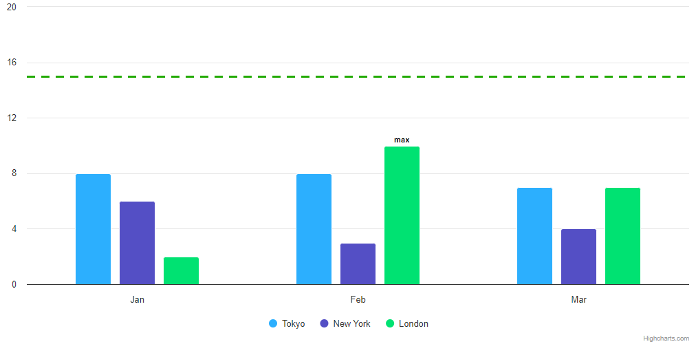

# Exercise 05 - Finding Max

Level: intermediate ⭐⭐

In this exercise, you will learn how to:

1. Generate and Configure Series (create multiple data series, and customize their properties dynamically)
2. Implement Conditional Data Labels.
3. Manipulate `yAxis` Properties (set dynamic yAxis maximum values).

In this task, you'll create a simple column chart and use the load event to set dynamic options when the chart is initially loaded.

## Instructions

0. **Good to know**

- To run the test, use the following command: `npm run test-05`

1. **Generate 3 Column Series with Random Data**

- Objective
  - Create three series with random integer data ranging from 0 to 9.
- Details/tips
  - Each series should represent a column chart.
    - [Column chart demo](https://www.highcharts.com/demo/highcharts/column-basic)
  - Random data can be generated using JavaScript's `Math.random()` function and then rounded to get integers.
    - Example on how to use [`Math.random()`](https://developer.mozilla.org/en-US/docs/Web/JavaScript/Reference/Global_Objects/Math/random) and [`Math.random()` with Highcharts demo](https://www.highcharts.com/demo/highcharts/scatter-jitter)

2. **Identify the Maximum Column and Add Data Labels**

- Objective
  - Find the highest column (or multiple columns if there are ties) and display the `max` label above it.
- Details/tips
  - Use data labels to show `max` above columns with the maximum value.
    - Data Labels: https://api.highcharts.com/highcharts/plotOptions.series.dataLabels
  - Ensure no other columns have data labels unless they also share the maximum value.
    - Maybe you should think about `this.series.yAxis.dataMax` 😉

3. **Set dynamic yAxis Maximum to Twice the Maximum Data Value**

- Objective
  - Set the `yAxis` maximum (`yAxis.max`) to be exactly 2 times the value of the highest column
- Details
  - Dynamically calculate `yAxis.max` based on the highest data value and ensure it updates correctly when the chart loads.
  - Use the `chart.events.load` event to perform these updates when the chart is first rendered.
  - Be aware that `yAxis.max` may not always be applied due to Highcharts' internal calculations. Use the `tickInterval` option to control this behavior and ensure the correct max is displayed.
  - Use the `chart.update` and `axis.update` methods to dynamically change the chart and axis properties when necessary.
- Documentation/tip
  - This might be useful `const maxn = this.yAxis[0].dataMax;` 😉
  - yAxis Max: https://api.highcharts.com/highcharts/yAxis.max
  - yAxis Update Method: https://api.highcharts.com/class-reference/Highcharts.Axis#update
  - Chart Load Event: https://api.highcharts.com/highcharts/chart.events.load
  - Chart Update Method: https://api.highcharts.com/class-reference/Highcharts.Chart#update
  - Tick Interval: https://api.highcharts.com/highcharts/yAxis.tickInterval
