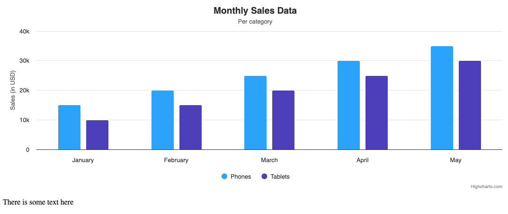

# Exercise 01 - Accessible chart options

Level: easy ⭐

In this exercise, you will learn how to:

1. Include the accessibility module
2. Create a basic accessible chart by adding titles and labels to chart elements.
3. Adding names to series for better readability
4. Give suffix to a tooltip and make it sticky
5. Add a description to your chart.

In this task, you will create an interactive Highcharts chart with default values for the Accessibility module, which will make the chart more readable and easier to understand for sighted users and screen reader users. You will look at how a tooltip can easily be improved to provide readability and give the user an easier time exploring with it. You will also add a description to help your readers understand what the chart is about.

## Instructions

0. **Good to know**
  * To run the test, use the following command: `npm run test-01-a11y`

1. **Include Accessibility Module**

* Objective
  * Ensure that the "accessibility" module are correctly loaded.
* Details
  * Ensure that the chart has no warnings in the console.
* Documentation
  * Accessibility Module: https://www.highcharts.com/docs/accessibility/accessibility-module

2. **Set up a chart with a title, subtitle and title or categories for the axes**

* Objective
  * The chart will be easier to read when you label all the chart elements presented.
* Details
  * Give the chart a title that says "Monthly Sales Data"
  * Give the chart a subtitle that says "Per category"
  * Give the yAxis a title of "Sales (in USD)"
  * Give the xAxis categories for 'January', 'February', 'March', 'April', 'May'
* Documentation
  * `title`: https://api.highcharts.com/highcharts/title
  * `subtitle`: https://api.highcharts.com/highcharts/subtitle
  * `xAxis`: https://api.highcharts.com/highcharts/xAxis
  * `yAxis`: https://api.highcharts.com/highcharts/yAxis

3. **Add names to series**

* Objective
  * Add names to series for better readability of the chart.
* Details
  * Add the series name "Phones" to the first series.
  * Add the series name "Tablets" to the second series.
* Documentation
  * `series.column`: https://api.highcharts.com/highcharts/series.column

4. **Give suffix to the tooltip of the chart and make the tooltip sticky**

* Objective
  * Allow users to explore the tooltip without the tooltip disappearing when hovering.
  * Allow users to understand the context of the point, by adding value suffix.
* Details
  * Set `stickOnContact` to be true to enable the sticky tooltip.
  * Add the correct `valueSuffix` for your datapoints on the tooltip.
* Documentation
  * Tooltip: https://api.highcharts.com/highcharts/tooltip

5. **Give a description to the chart**

* Objective
  * Ensure that you give the chart a description to help your readers understand what the chart is about.
* Details
  * Add a linked description to the chart.
  * Write a proper description of the chart. It can be 2-3 sentences long.
* Documentation
  * Demo pages (to view other chart descriptions): https://www.highcharts.com/demo
