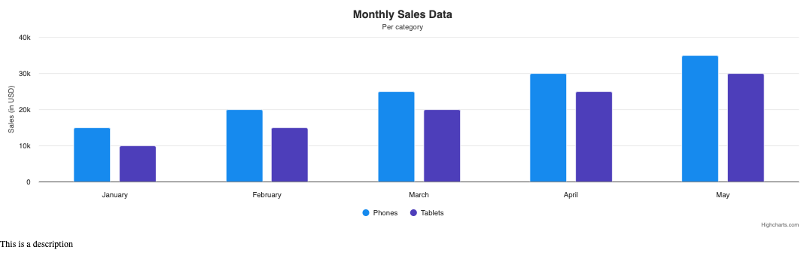

# Exercise 02 - Accessible chart options
Level: easy ⭐

In this exercise, you will learn how to:
1. Give series a color that comply with the contrast requirement.

In this task, you will take a look at the column color contrast against the background color of the chart.

## Instructions:
1. **Include Accessibility Module**
* Objective
  * Ensure that the "accessibility" module are correctly loaded.
* Details
  * Ensure that the chart has no warnings in the console.
* Documentation
  * Accessibility Module: https://www.highcharts.com/docs/accessibility/accessibility-module

2. **Change color of column to give colors enough color contrast**
* Objective
  * Ensure that the columns has a 3:1 color contrast against the background color of the chart.
* Details
  * Use a color contrast checker tool to find a suitable colors for the columns with enough contrast.
* Documentation
  * WebAIM contrast checker: https://webaim.org/resources/contrastchecker/