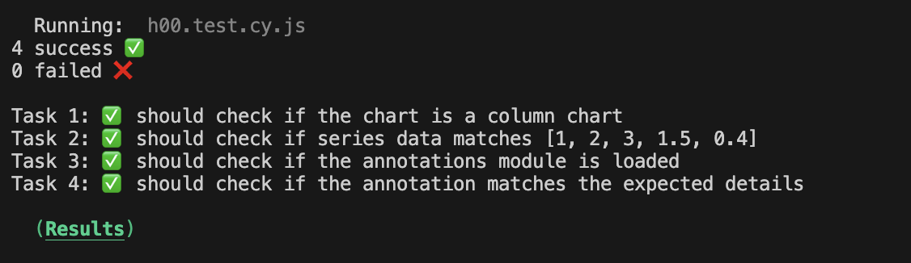
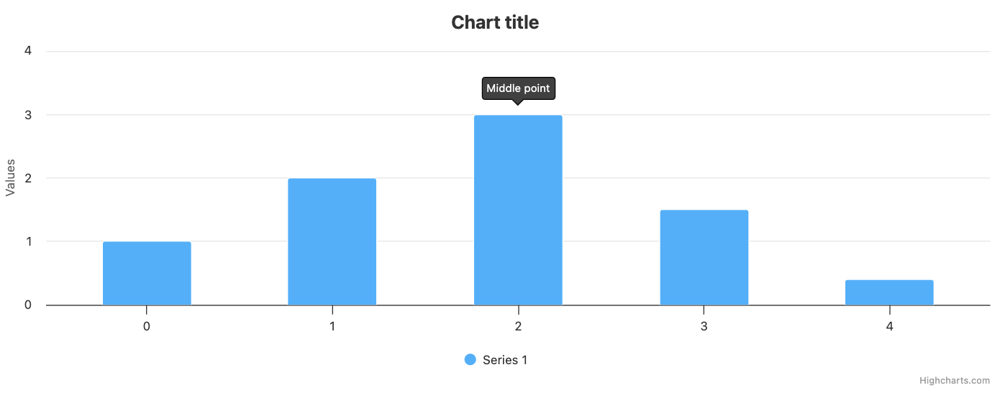

# Exercise 00 - Getting Started with Highcharts Academy

**Level:** Beginner ⭐

---

## Welcome to Highcharts Academy  
This introductory exercise is designed to help you understand how to navigate and use the Highcharts Academy courses effectively. 
By completing this exercise, you'll learn how to:

1. Understand exercise structure and instructions.
2. Add the right code in the right file.
3. View your results.
4. Run automated tests to validate your work.

---

## Let’s Get Started  
Every exercise in Highcharts Academy is divided into two main sections:  
1. **Goal**  
2. **Instructions**  

The **Goal** section outlines what you'll learn and achieve in the exercise.  
The **Instructions** section breaks down the steps required to meet the goal, along with helpful links, tips, and demos to guide you.

---

## Exercise Overview

### Goal  
Learn to create a **column chart** and add an **annotation**.

---

## Instructions

### Objective 1: Create a Column Chart
1. **Create a simple column chart**:
   - Add a dataset with 5 random points (e.g., `[1, 2, 3, 1.5, 0.4]`).
   - Documentation:  
     - [Column Chart Docs](https://api.highcharts.com/highcharts/chart.type)  
     - [Column Chart Demo](https://www.highcharts.com/demo/column-basic)

2. **Solution**:  
   - Open the `main.js` file in your code editor (e.g., Visual Studio Code).  
   - Add the following code:  
     ```javascript
     Highcharts.chart('container', {
         chart: {
             type: 'column'
         },
         series: [{
             data: [1, 2, 3, 1.5, 0.4]
         }]
     });
     ```
   - Save your work.  
   - Open the `index.html` file in your browser to view the result.  
   - Run the command:  
     ```bash
     npm run test-00
     ```
   - If successful, you will see this output:  
    

---

### Objective 2: Add an Annotation
1. **Add an annotation module**:
   - Include the Highcharts Annotation module in your chart.  
   - Documentation:  
     - [Annotations Module](https://api.highcharts.com/highcharts/annotations)  
     - [Annotation Demo](https://www.highcharts.com/demo/annotations)

2. **Add an annotation to the third point**:
   - Example: Add a label above the third point with the text "Peak Value".  
   - Documentation:  
     - [Add Annotation to a Point](https://api.highcharts.com/highcharts/annotations.labelOptions)

3. **Solution**:  
   - Add the following annotation configuration to your chart:  
     ```javascript
     Highcharts.chart('container', {
         chart: {
             type: 'column'
         },
         series: [{
             data: [1, 2, 3, 1.5, 0.4]
         }],
         annotations: [{
             labels: [{
                 point: {
                     x: 2,
                     y: 3,
                     xAxis: 0,
                     yAxis: 0
                 },
                 text: 'Middle value'
             }]
         }]
     });
     ```
   - Save your work.
   - Go to `index.html`, and paste the annotation module
   ```html
   <script src="https://code.highcharts.com/modules/annotations.js"></script>
   ```

   - Open `index.html` in your browser to see the annotation.
   - Run the command:  
     ```bash
     npm run test-00
     ```
   - If successful, you will see this output:
    
    
   - Go to the browser where you opened index.html, refresh the page, and you should see:

   


---

## Checklist Before Submission
- Ensure your column chart is visible and matches the example provided.  
- The annotation is correctly added to the third point.  
- Run `npm run test-00` to verify your solution.

**Congratulations! You've completed your first exercise in Highcharts Academy! 🎉**
