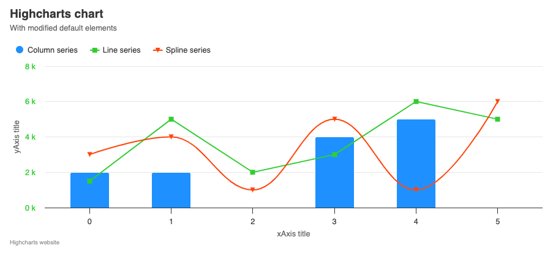

# Exercise 02 - Axes Options
Level: easy ⭐

In this exercise, you will learn how to:
1. Customize chart elements (adjust `titles`, `subtitles`, `credits`, and `legends`).
2. Configure axes and labels.

Your task is to modify the chart elements and default settings to exactly match the provided example. 

## Instructions:
1. **Titles and Credits**
* Objective
  * Align the chart `title` and `subtitle` to the `left` and set the text according to the example.
  * The `credits` should be positioned to the `left` with the text `Highcharts website`.
* Details
  * Title: Should read `Highcharts chart` and be aligned to the `left`.
  * Subtitle: Should read "With modified default elements" and be aligned to the `left`.
  * Credits: Should be aligned to the `left` and the text should be `Highcharts website`.
* Documentation
  * Chart Title: https://api.highcharts.com/highcharts/title
  * Chart Credits: https://api.highcharts.com/highcharts/credits

2. **Legend and Axes**
* Objective
  * Adjust the legend position and configure the x-axis and y-axis titles and labels.
* Details
  * Legend: Move to the top left corner of the chart.
  * `xAxis` Title: Set to `xAxis title`.
  * `yAxis` Title: Set to `yAxis title`.
  * `yAxis` Labels: Style labels in green (`#32CD32`) and format them to display ` k` at the end (e.g., "100 k").
* Documentation
  * Legend Configuration: https://api.highcharts.com/highcharts/legend
  * xAxis Title: https://api.highcharts.com/highcharts/xAxis.title
  * yAxis Title: https://api.highcharts.com/highcharts/yAxis.title
  * yAxis Labels: https://api.highcharts.com/highcharts/yAxis.labels
